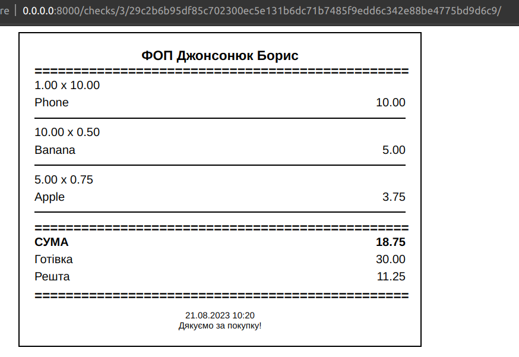
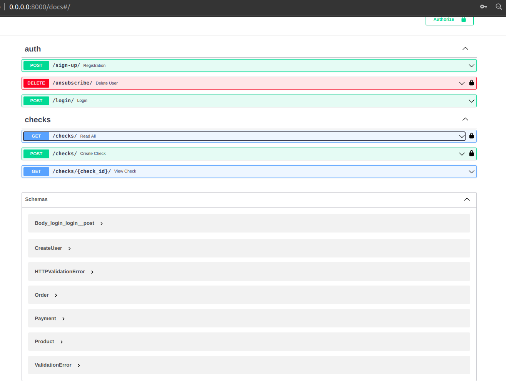

# Check Generator API

Welcome to the **Check Generator API** repository! This project leverages the power of FastAPI and PostgreSQL to provide a simple yet efficient API for generating checks.

## Requirements

Make sure that you have installed:

1. PostgreSQL
2. Python3.11

## Overview

The **Check Generator API** is a web application built using FastAPI, a modern and high-performance Python web framework. It offers an intuitive interface to create, view.

## Features

- Create new checks with customizable fields such as buyer_name, amount, date.
- Retrieve a list of checks with filtering and sorting options.
- View detailed information about individual checks.
- Built-in Swagger documentation for easy API exploration.

## Technologies Used

- **FastAPI**: A modern web framework for building APIs with Python.
- **PostgreSQL**: A powerful open-source relational database management system.
- **SQLAlchemy**: An Object-Relational Mapping (ORM) library for working with databases.
- **Alembic**: A database migration tool for SQLAlchemy that automates schema changes.
- **Pydantic**: A data validation and settings management library for creating data models and serializing/deserializing data.
- **Pytest**: A testing framework that makes it easy to write simple and scalable test cases in Python.
- **uvicorn**: An ASGI server that runs FastAPI applications.
- **Python3.11**: The latest version of the Python programming language..

## Setup and Usage

1. Clone the repository: `git clone git@github.com:flyosprey/check_generator_api.git`
2. Navigate to the project directory
3. Install dependencies using **pip**: `pip install -r requirements.txt`
4. Create and set up `.env` file based on `.env.example` file. Actually, you can copy all `.env.example` info to `.env`
5. Create and set up `alembic.ini` file based on `alembic.ini.example` file. Actually, you need set database url there `sqlalchemy.url = <your_database_url>`. It should be the same as in `.env`
6. Run the API using the following command: `uvicorn main:app --reload`
7. Access the API documentation at [http://127.0.0.1:8000/docs](http://127.0.0.1:8000/docs) to interact with the API and explore available endpoints.

## Endpoints

### Authentication Endpoints

#### Create New User
**POST** `http://127.0.0.1:8000/auth/users`

Create a new user account with the provided user details. This endpoint is used for user registration.

#### Delete User (Auth required)
**DELETE** `http://127.0.0.1:8000/auth/users`

Delete the user account associated with the provided user credentials. This endpoint allows users to delete their account.

#### Login for Access Token
**POST** `http://127.0.0.1:8000/auth/token`

Authenticate the user's credentials and generate an access token. This token is required to access protected API endpoints.

### Checks Endpoints

#### Read All Checks (Auth required)
**GET** `http://127.0.0.1:8000/checks?page=1&per_page=5`

Retrieve a list of all checks. This endpoint provides a paginated list of checks available in the system for a user.
In this endpoint you can sort data by these following query parameters

1. **per_page** - how many records will be on a page
2. **page** - page number
3. **total_from** - minimal total cost of a check to search
4. **date_from** - from to present period of created check to search
5. **payment_type** - payment type of check **'cash'** or **'cashless'**

#### View Check
**GET** `http://127.0.0.1:8000/checks/{check_id}`

View detailed information about a specific check identified by its unique `check_id`.

#### Create Check (Auth required)
**POST** `http://127.0.0.1:8000/checks`

Create a new check by providing the necessary details such as buyer name, amount, quantity, date. This endpoint is used to generate new checks.

## Additional

1. **You can change develop environment to QA or DEV.**

## Examples

